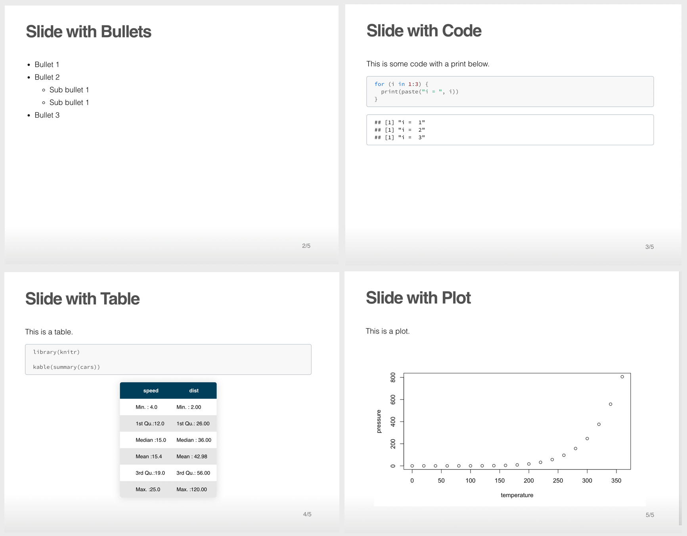

# ioslides-theme
This is my personal theme for **ioslides** with RMarkdown. Much wow... 🤩

## Instructions

- Download the `src/custom.css` file
- Place it in the same folder of your `.Rmd` document
- In the front matter, specify `css: custom`
- When you knit the ioslides, they will appear with your new customized theme! 🎉

Example below and in the repo.

